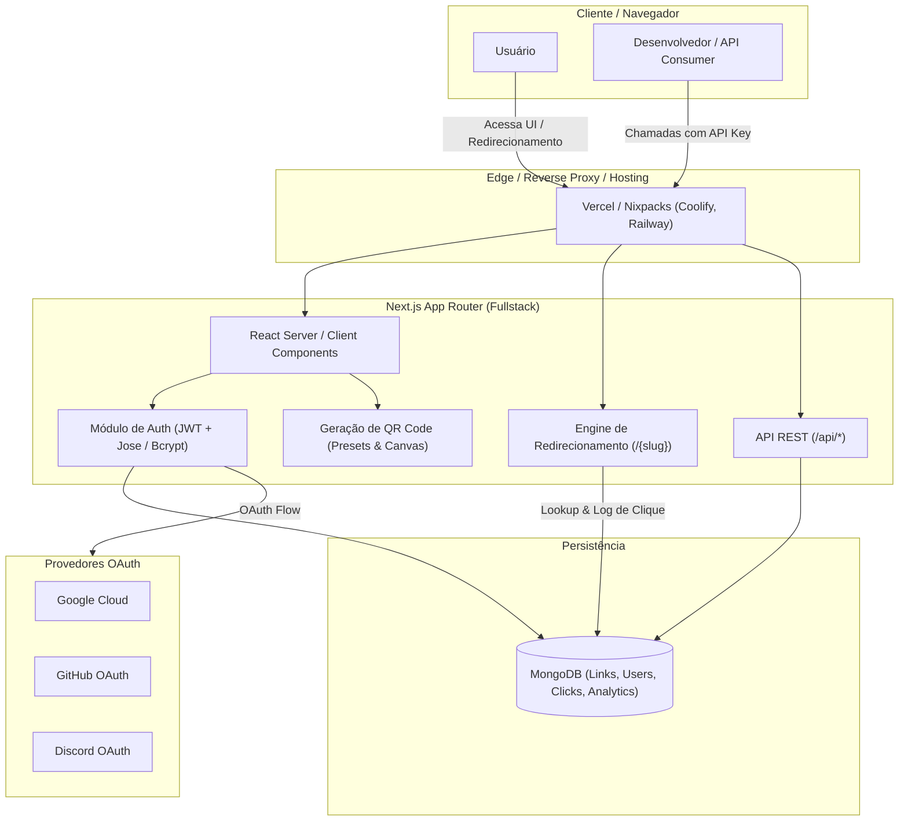
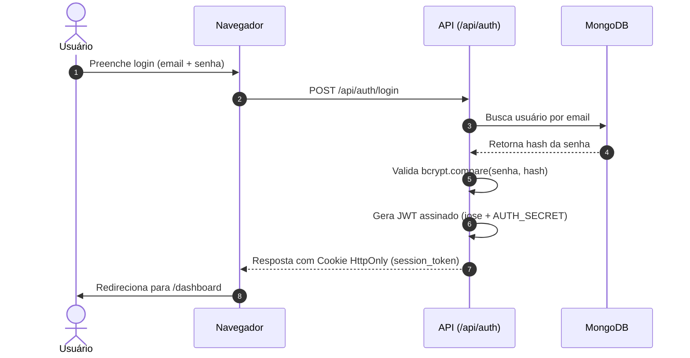

# Arquitetura do Sistema

Este documento descreve a visão geral arquitetural, decisões de design, modelos de dados e fluxos de execução do **Link**.

---

## 🗺️ Visão Geral

O **Link** é uma aplicação web full-stack desenvolvida com Next.js (App Router) que combina encurtamento rápido de URLs, autenticação flexível (credenciais + OAuth), geração customizada de QR Codes, painel de métricas analíticas e API pública/privada.



---

## 📂 Estrutura de Diretórios

```txt
link/
├── .github/                  # Configurações do GitHub (Workflows, Templates, Dependabot)
│   ├── ISSUE_TEMPLATE/       # Templates para issues (bugs, features, security)
│   ├── workflows/            # GitHub Actions (CI, Security Audit, CodeQL)
│   ├── CODEOWNERS            # Atribuição de responsabilidade por código
│   └── PULL_REQUEST_TEMPLATE.md
├── .vscode/                  # Configurações compartilhadas para VSCode
├── database/                 # Scripts de inicialização e índices do MongoDB
│   └── mongodb-setup.js      # Criação de índices e validações de coleção
├── public/                   # Arquivos estáticos, logos, imagens Open Graph
├── src/
│   ├── app/                  # Next.js App Router (Páginas, Layouts e API Routes)
│   │   ├── (auth)/           # Rotas de login, cadastro, recuperação de senha
│   │   ├── api/              # Endpoints da API REST (auth, links, dashboard, stats)
│   │   ├── dashboard/        # Painel autenticado do usuário
│   │   ├── documentacao/     # Documentação interativa da API
│   │   ├── [slug]/           # Rota dinâmica de resolução e redirecionamento de links
│   │   └── layout.tsx        # Layout raiz com fontes e providers
│   ├── components/           # Componentes React reutilizáveis
│   │   ├── dashboard/        # Componentes do painel (tabelas, gráficos, cards)
│   │   ├── documentation/    # Componentes da documentação da API
│   │   └── ui/               # Componentes de interface base (botões, inputs, cards)
│   └── lib/                  # Camada de lógica de negócio e infraestrutura
│       ├── auth.ts           # Utilitários de autenticação de sessão
│       ├── jwt.ts            # Assinatura e verificação de JWT com jose
│       ├── mongodb.ts        # Conexão singleton e cliente do MongoDB
│       └── utils.ts          # Helpers gerais (formatação, validação de slug)
├── ARCHITECTURE.md           # Este documento de arquitetura
├── CHANGELOG.md              # Registro de alterações e versões
├── COMMIT_CONVENTION.md      # Convenção de mensagens de commit
├── CONTRIBUTING.md           # Guia de contribuição
├── LICENSE                   # Licença GNU AGPLv3
├── README.md                 # Documentação principal
├── SECURITY.md               # Política de segurança
├── nixpacks.toml             # Configuração para deploy em Nixpacks / Containers
└── package.json              # Dependências e scripts do projeto
```

---

## 🔐 Fluxo de Autenticação e Segurança

A autenticação é desenhada para operar de forma híbrida:

1. **Email / Senha**: Senhas são hasheadas com `bcryptjs` (salt rounds padrão = 10) e salvas na coleção `users`.
2. **OAuth 2.0 (Google, GitHub, Discord)**:
   - O usuário inicia o login em `/api/auth/oauth/<provider>`.
   - O callback `/api/auth/oauth/<provider>/callback` valida o código, obtém o perfil e cria ou vincula a conta no MongoDB.
3. **Sessão JWT**:
   - Sessões são mantidas via tokens JWT assinados com `jose` usando o `AUTH_SECRET`.
   - O token é armazenado em cookies `HttpOnly` seguros.
4. **API Keys**:
   - Desenvolvedores geram chaves de API com prefixo `link_` no dashboard.
   - Requisições para `/api/*` aceitam `X-API-Key: <chave>` ou `Authorization: Bearer <chave>`.



---

## ⚡ Fluxo de Redirecionamento e Analytics

O redirecionamento do slug curto (`/{slug}`) é otimizado para velocidade:

1. O cliente faz a requisição `GET /{slug}`.
2. A aplicação faz a busca indexada pelo campo `slug` no MongoDB.
3. Caso não exista, renderiza a página de 404 customizada.
4. Caso exista:
   - Registra o evento de clique de forma assíncrona (país, região, cidade, referrer, user-agent e timestamp).
   - Incrementa o contador `clicks` do link.
   - Retorna um redirecionamento HTTP 307 (Temporary Redirect) ou 301 para a URL original.

---

## 🗄️ Modelo de Dados (MongoDB)

### Coleção: `users`
```json
{
  "_id": "ObjectId(...)",
  "name": "Guilherme Portilho",
  "email": "user@example.com",
  "passwordHash": "$2a$10$...",
  "apiKey": "link_abc123...",
  "providers": ["google", "credentials"],
  "createdAt": "ISODate(...)",
  "updatedAt": "ISODate(...)"
}
```

### Coleção: `links`
```json
{
  "_id": "ObjectId(...)",
  "userId": "ObjectId(...)",
  "slug": "portfolio",
  "url": "https://guidev.site",
  "clicks": 142,
  "qrCodeConfig": {
    "fgColor": "#000000",
    "bgColor": "#ffffff"
  },
  "createdAt": "ISODate(...)",
  "updatedAt": "ISODate(...)"
}
```

### Coleção: `clicks`
```json
{
  "_id": "ObjectId(...)",
  "linkId": "ObjectId(...)",
  "slug": "portfolio",
  "country": "BR",
  "region": "SP",
  "city": "Sao Paulo",
  "referrer": "https://twitter.com",
  "userAgent": "Mozilla/5.0 ...",
  "timestamp": "ISODate(...)"
}
```

---

## 🚀 Estratégia de Deploy

- **Vercel**: Integração nativa com Next.js App Router e Vercel Analytics.
- **Nixpacks / Docker (Coolify, Railway, Dokploy, Easypanel)**:
  - Definido via `nixpacks.toml` na raiz.
  - Node.js 22 LTS, build cache otimizado e inicialização com `npm run start`.
